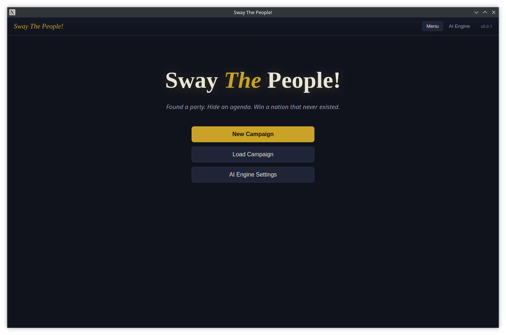
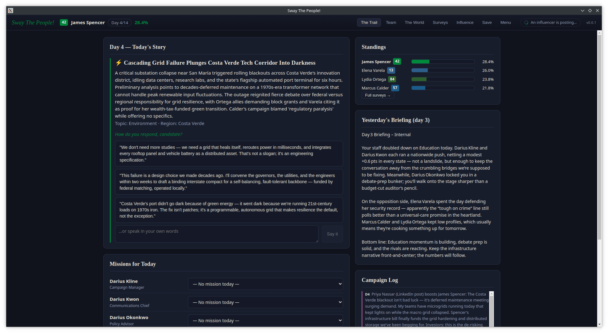

# Sway The People!

## Description

A political simulation game about running for president of a fictional nation — where a large
language model generates the world, the rivals, the debates and the consequences. Create a
candidate, found a party with a public _and a hidden_ agenda, hire councilors, fight for public
opinion across states and topics, and face the vote after a 14-day campaign.

## How to use

Before starting your first campaign, open the "AI Engine Settings" screen from the main menu and configure the LLM engine that will generate the game's content (check the "Dependencies" section below for the available options). Once the engine is configured, start a new campaign.

You will first create your candidate and found your party, choosing its name, colors and, most importantly, its two agendas: the public one, which the world sees, and the hidden one, which you will try to advance without being noticed. The game then generates the nation, its states, the rival parties and their candidates, and your party's platform on each topic area.

From there, the campaign runs day by day. Each day you respond to the news of the day, assign missions to the councilors you have hired (campaigning in a state, promoting a topic, courting an influencer, or preparing for debates), and follow the results through periodic surveys and your daily campaign briefing. On debate days you face the rival candidates directly — everything said in a debate becomes part of the campaign's memory, and can be quoted back later, by you or against you. After the final day comes election night, with per-state results, and an epilogue evaluating how far you managed to advance your hidden agenda.

You can save the campaign at any moment and load it later from the main menu.

## Dependencies

The application needs an LLM engine to generate the world and everything that happens in it. Two providers are supported: [Ollama](https://ollama.com/), for running models locally on your own machine (the preferred option), and [OpenRouter](https://openrouter.ai/), a cloud alternative if you cannot or do not want to run a model locally. There is also a Mock engine that plays fully offline with canned content, useful just to try out the game's flow without any model.

All configuration is done inside the application itself, on the "AI Engine Settings" screen — there are no command-line options or configuration files to edit. You can switch providers or models at any time, even mid-campaign.

Don't like the results you have been getting? Just try another model! The settings screen lets you pick any model available on your provider.

### Using Ollama (local)

The game expects an Ollama server running on your machine (by default at `http://localhost:11434`) with at least one model already downloaded. Ollama's documentation explains how to install it, start the server and pull models — check the quickstart guide at [https://ollama.com](https://ollama.com) and the model library for options. Models in the ~8B parameter range (such as `llama3.1:8b` or `qwen2.5:7b-instruct`) are good starting points.

Once the server is running, select the "Ollama (local)" tab on the settings screen, load the model list, pick a model and use the "Test connection" button to confirm everything is working.

### Using OpenRouter (cloud)

If you prefer a cloud engine, the game can use OpenRouter, which provides access to many hosted models through a single API. All you need is an OpenRouter account and an API key — check their documentation at [https://openrouter.ai/docs](https://openrouter.ai/docs) for how to create an account and generate a key (look for the "API Keys" section). Note that most models on OpenRouter are paid per usage, though free options are usually available.

With the key in hand, select the "OpenRouter (API)" tab on the settings screen, paste the key, load the model list, pick a model and use the "Test connection" button to confirm everything is working.

## How to run

_To be written — build and packaging tools have not been configured yet._

## How to build the project

_To be written — build and packaging tools have not been configured yet._

## More info

Design documents: [`PRD.md`](docs/PRD.md) (product) · [`TECHSPEC.md`](docs/TECHSPEC.md) (technical) ·
[`MVP_SCOPE.md`](docs/MVP_SCOPE.md) (current scope) · [`ARCHITECTURE.md`](ARCHITECTURE.md) (invariants)
· [`AGENTS.md`](AGENTS.md) (contributor/agent guide).

Development documentation: [DEVELOPMENT.md](docs/DEVELOPMENT.md).
